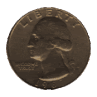
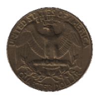

# That QM Entanglement Thing

M.C.A. (Marco) Devillers

---

# A spinning coin

the behavior of the system can be described as:

$$ |\Psi\rangle = \frac{1}{\sqrt{2}} (|h\rangle - |t\rangle) $$

the system doesn't have a definite state

---

# Bell's inequalities

**Conjecture** Bell shows inequalities violated by systems with definite states, not 'oscillating' states

instead of: locality and realism cannot both hold 

**Conjecture** locality and realism hold assuming time-dependent 'oscillating' states

---

# Three arguments for 'oscillating' states

1. metamathical: the difference between superposition and 'oscillation' is neglible
2. the math allows for 'oscillating' states
3. there's a physical model satisfying Bell's inequality

----

# The metamathical argument

_a spinning coin_

_a coin in superposition_

[  +  ]

flipping the coin or collapsing the wave function is a neglible difference

superposition for this system can be seen as abstracting from the time component

superposition and oscillating between states can be made indistinguishable

----

# Going back to Bell

the quantum-mechanical prediction for the correlation between two detectors is

$$ P(\vec{a}, \vec{b}) = - \vec{a} \cdot \vec{b} $$

Bell: a local hidden variable model for these correlations would explain them in terms of an integral over the possible values of some hidden parameter $\lambda$:

$$ P(\vec{a}, \vec{b}) = \int d\lambda\, \rho(\lambda) A(\vec{a}, \lambda) B(\vec{b}, \lambda) $$

where $\rho(\lambda)$ is a probability density function

_note_: Bell's argument is mostly indifferent to a superposition v. 'oscillation' debate

however, the probability of observing a property for each detector is replaced with determinate values $A(\vec{a}, \lambda)$ and $B(\vec{b}, \lambda)$

----

# Going back to Bell (2)

by assuming a collapse from a definite state to a definite value Bell shows that QM superposition or 'oscillating' states defy his inequality

Bell isn't wrong in assuming a definite state (could encode a probability distribution)

Bell is wrong in assuming a definite state _results_ in a definite measurement

prove 'spooky action at a distance': show changing $a$ changes the distribution at $b$

----

# CHSH inequality

