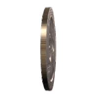

# That QM Entanglement Thing

M.C.A. (Marco) Devillers

---

# A spinning coin

the behavior of the system can be described as:

$$ |\Psi\rangle = \frac{1}{\sqrt{2}} (|h\rangle - |t\rangle) $$

the system doesn't have a definite state

---

# Bell's inequalities

**Conjecture** Bell shows inequalities violated by systems with definite states, not 'oscillating' states

instead of: locality and realism cannot both hold 

**Conjecture** locality and realism hold assuming time-dependent 'oscillating' states

---

# Three arguments for 'oscillating' states

1. Metamathical: the difference between superposition and 'oscillation' is neglible
2, The math allows for 'oscillating' states
3. There's a physical model satisfying Bell's inequality

----

# The metamathical argument

Left a spinning coin, right a coin in superposition

----

# Bell

$$ P(\vec{a}, \vec{b}) = - \vec{a} \cdot \vec{b} $$

Bell posited that a local hidden variable model for these correlations would explain them in terms of an integral over the possible values of some hidden parameter $\lambda$:

$$ P(\vec{a}, \vec{b}) = \int d\lambda\, \rho(\lambda) A(\vec{a}, \lambda) B(\vec{b}, \lambda) $$

where $\rho(\lambda)$ is a probability density function.
