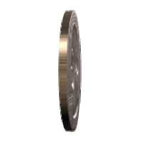

# That QM Entanglement Thing

M.C.A. (Marco) Devillers

---

# A spinning coin

the behavior of the system can be described as:

$$ |\Psi\rangle = \frac{1}{\sqrt{2}} (|h\rangle - |t\rangle) $$

the system doesn't have a definite state

---

# Bell's inequalities

**Conjecture** Bell shows inequalities violated by systems with definite states, not 'oscillating' states

instead of: locality and realism cannot both hold 

**Conjecture** locality and realism hold assuming time-dependent 'oscillating' states

---

# Progress

